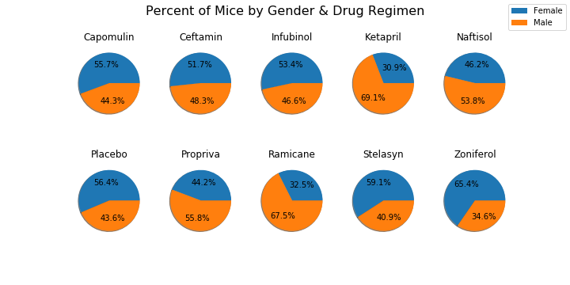
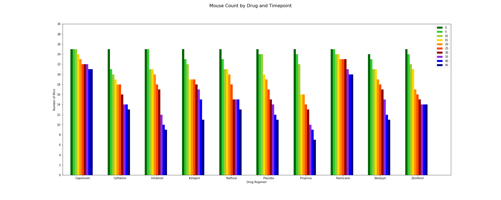
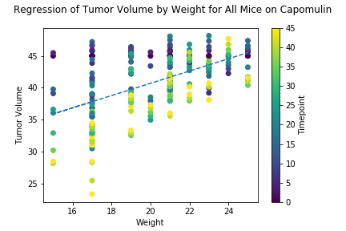

## Observations from Matplotlib Mouse Analysis

 The current study lookes at the impact of 9 drug regimens and a placebo on tumor size in mice (N = 249). Each mouse was weighed and their tumor measured every 5 days for 45 days. 25 mice were assigned to each drug group with the exception of Stelasyn which began with 24 mice. 
 
 The gender breakdown of mice was roughly equal for the study as a whole (49.3% female, 50.7% male). However, several drug regimes displayed gender skew including Ketapril (30.9% female, 69.1% male) and Zoniferol (65.4% female, 34.6% male). In future studies the impact of gender on survival should be considered. 

 

Initial findings indicate that the type  of drug regimen impacted the number of mice that survived till the end of the study. The top performing drugs for survival included Capomulin (n=21 survival) and Ramicane (n=20 survival). 

Interestingly, the drug regimens with the smallest average tumor volumn did not necessarily have the highest survival rate. Infubinol, for example, had a final average tumor volumn of 65.75 mm3 and a final survivor count of 9 mice. Ramicane on the other hand had a survivor count of 14 mice but a final average tumor volumn of 65.96 mm3. This can also be seen to a lesser extent with in Zoniferol (n = 14, 65.96 mm3) vs Ceftamin (n=13, 64.13 mm3). 

There are several potential explinations for this phenominon. First, some drugs may produce greater results in survivors, but with more leathal side effects. This may be the case with Zoniferol and Ceftamin. Second, mediating variables such as weight and sex of the mice may impact success. Finally, in the case of Infubinol, outliers may be skewing the results.

Lending weight to the possibility that the initial weight of the mice may mediate drug effectiveness, a regression analysis was conducted to determine the impact of weight on tumor volumn. Findings suggest that weight of mouse can explain a significant amount of the variance in tumor volumn (r^2 = .27, sig < .05). 

Future work should thus control for the weight of mice across drug groups. 